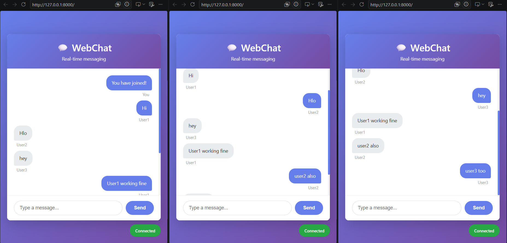
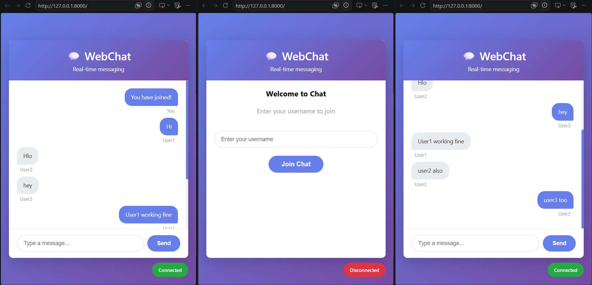

# 💬 FastAPI WebSocket Chat

A real-time chat application built using FastAPI and WebSockets.

## 🚀 Live Demo

https://webchat-l64g.onrender.com

## 📸 Screenshot




## ✨ Features

- Real-time messaging
- Multiple users
- Username support
- Responsive UI
- WebSocket communication

## 🛠 Tech Stack

- FastAPI
- Python
- HTML
- CSS
- JavaScript
- WebSockets

## 📦 Installation

```bash
git clone https://github.com/yourusername/WebChat.git
cd WebChat
pip install -r requirements.txt
uvicorn main:app --reload